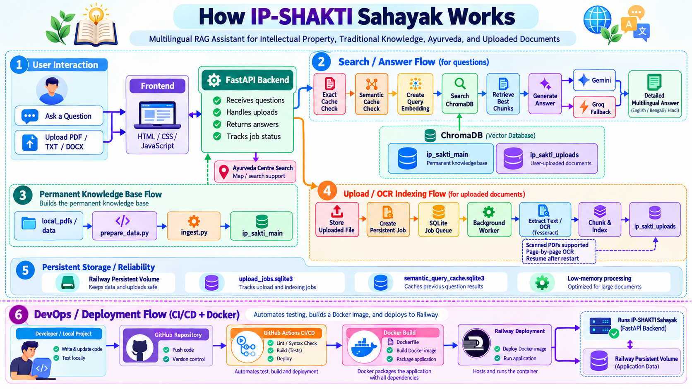

# AyurSetu AI

**Connecting Traditional Wisdom with Modern AI**

**AyurSetu AI** is a multilingual RAG-based AI assistant for:

- Intellectual Property
- Patents
- Trademarks
- Copyright
- International IP systems
- Traditional Knowledge
- Ayurveda
- User-uploaded documents
- Ayurveda centre search

The application supports **English, Bengali and Hindi** and combines:

- FastAPI
- Google Gemini
- Groq fallback
- ChromaDB
- OCR with Tesseract
- Persistent Railway storage
- Resumable page-by-page document indexing
- Persistent semantic query caching
- Live indexing progress
- Fast knowledge-base search


> **Project branding:** The public project name is **AyurSetu AI**.  
> Existing internal identifiers such as `ip_sakti_main`, `ip_sakti_uploads`,
> SQLite database names, and the current GitHub repository URL are kept unchanged
> to avoid breaking the deployed application.


---


---

# 🌈 How AyurSetu AI Works

<p align="center">
  
</p>

> 🚀 **AyurSetu AI** combines document ingestion, OCR, RAG search, semantic caching, AI answer generation, Docker, CI/CD, and Railway deployment into one complete workflow.

---

## 👤 1. User Interaction

Users interact with the application through the web interface.

### 💬 Ask a Question

A user enters a question related to:

- 🧠 Intellectual Property
- 📜 Patents
- ™️ Trademarks
- ©️ Copyright
- 🌍 International IP systems
- 🌿 Ayurveda
- 📚 Traditional Knowledge
- 📄 Uploaded documents

The frontend sends the question to the **FastAPI backend**.

### 📤 Upload a Document

Users can upload:

```text
PDF
TXT
DOCX
```

Uploaded documents are stored and automatically sent to the indexing pipeline.

---

## 🖥️ 2. Frontend Layer

The frontend is implemented using:

```text
HTML
CSS
JavaScript
```

Its responsibilities include:

| Feature | Purpose |
|---|---|
| 💬 Question input | Sends questions to the backend |
| 📤 File upload | Uploads PDF/TXT/DOCX documents |
| 📊 Progress display | Shows OCR/indexing progress |
| 🧾 Source display | Shows retrieved source documents |
| ⚡ Timing display | Shows search and AI response times |
| 🌐 Language selection | English / Bengali / Hindi |

The frontend communicates with the backend through FastAPI endpoints.

---

## ⚙️ 3. FastAPI Backend

The FastAPI backend acts as the central controller of the project.

```text
frontend
   ↓
FastAPI
   ↓
RAG / Upload Worker / Cache / AI / Search
```

It performs the following tasks:

- ✅ receives user questions
- ✅ accepts file uploads
- ✅ creates persistent indexing jobs
- ✅ searches the knowledge base
- ✅ calls Gemini or Groq
- ✅ returns answers and sources
- ✅ reports upload/indexing status
- ✅ handles Ayurveda centre search

---


## 📍 Find Ayurveda Centres

**AyurSetu AI** includes a location-aware Ayurveda centre search feature.

Users can search Ayurveda centres by:

- **City**
- **State**
- **Current location**

### Powered by SerpAPI

The Ayurveda centre search feature uses **SerpAPI**.

```text
User enters city/state/current location
        ↓
FastAPI backend
        ↓
SerpAPI
        ↓
Ayurveda centre search results
        ↓
Map / list display
```

This feature is integrated into the same web application but is separate from the document RAG pipeline.


# 🔎 4. Search and Answer Flow

When the user asks a question, IP-SHAKTI follows this sequence:

```text
Question
   ↓
Exact Cache Check
   ↓
Semantic Cache Check
   ↓
Create Query Embedding
   ↓
Search ChromaDB
   ↓
Retrieve Best Chunks
   ↓
Build RAG Prompt
   ↓
Gemini
   ↓
Groq Fallback (if required)
   ↓
Detailed Multilingual Answer
```

---

## ⚡ Step 1: Exact Cache Check

The application first checks whether the exact same question has already been answered.

```text
Question
   ↓
Exact cache hit?
   ├── YES → return answer immediately
   └── NO  → continue
```

If an exact cache result exists:

- no embedding is required
- no ChromaDB search is required
- no Gemini/Groq API call is required

This provides the fastest possible response.

---

## 🧠 Step 2: Semantic Cache Check

If no exact match exists, the application checks for a highly similar previous question.

Example:

```text
What is a patent?
```

and:

```text
Explain the meaning of patent.
```

may have very similar embeddings.

If similarity is above the configured threshold:

```text
RAG_SEMANTIC_CACHE_THRESHOLD=0.97
```

the previous answer may be reused.

---

## 🧩 Step 3: Query Embedding

For a new question, an embedding vector is created.

The embedding model is:

- loaded once
- warmed during startup
- reused for later requests
- cached for repeated questions

This optimization reduced search time significantly.

### 📊 Observed performance

Before optimization:

```text
Search: 5.85s
AI:     1.88s
Total:  7.73s
```

After embedding warm-up and caching:

```text
Search: 1.97s
AI:     1.17s
Total:  3.14s
```

---

## 🗃️ Step 4: Search ChromaDB

The system searches two collections:

### 🔵 Permanent Knowledge Base

```text
ip_sakti_main
```

Contains permanent reference material.

### 🟣 User Upload Knowledge Base

```text
ip_sakti_uploads
```

Contains documents uploaded by users.

Both collections can be searched in parallel.

---

## 📚 Step 5: Retrieve Best Chunks

The system retrieves the most relevant document chunks.

Current configuration:

```text
top_k=6
final_results=4
```

These chunks are used to build the context for the AI.

---

## 🤖 Step 6: Generate the Answer

Primary provider:

```text
Google Gemini
```

Fallback provider:

```text
Groq
```

Flow:

```text
Gemini available?
   ├── YES → generate answer
   └── NO  → Groq fallback
```

The result is returned as a detailed educational answer.

---

## 🌐 Step 7: Multilingual Output

The assistant supports:

- 🇬🇧 English
- 🇮🇳 Bengali
- 🇮🇳 Hindi

The selected language is passed to the RAG prompt.

---

# 📚 5. Permanent Knowledge Base Flow

Permanent source documents follow this pipeline:

```text
local_pdfs/
    ↓
prepare_data.py
    ↓
data/<category>/*.txt
    ↓
ingest.py
    ↓
Chunking
    ↓
ip_sakti_main
```

### 📁 Knowledge categories

```text
ayurveda
copyright
international
patents
regulations
trademarks
traditional_knowledge
```

This design avoids pushing large PDFs directly to Railway.

---

# 📤 6. Upload + OCR Indexing Flow

Uploaded documents follow a separate pipeline.

```text
Upload File
    ↓
Save File
    ↓
Create Persistent Job
    ↓
SQLite Job Queue
    ↓
Background Worker
    ↓
Extract Text
    ↓
OCR if required
    ↓
Chunk Text
    ↓
Index in ChromaDB
    ↓
ip_sakti_uploads
```

---

## 🧾 Normal PDF

For normal PDFs:

```text
pypdf
   ↓
Text extraction
```

If enough text is found, OCR is skipped.

---

## 🔍 Scanned PDF

For image-only PDFs:

```text
PDF Page
   ↓
PyMuPDF
   ↓
Image
   ↓
Tesseract OCR
   ↓
Extracted Text
```

OCR is used when page text is below:

```text
OCR_MIN_PAGE_TEXT=20
```

---

# 🧠 7. Low-Memory Page-by-Page OCR

Large PDFs are never loaded completely into memory.

Instead:

```text
Page 1
→ OCR
→ save
→ chunk
→ index
→ release RAM

Page 2
→ OCR
→ save
→ chunk
→ index
→ release RAM

...

Page N
```

This keeps memory usage relatively stable even for large PDFs.

---

## 🧪 OCR Stress-Test Results

| 📄 Pages | 📚 Chunks | ⏱️ Time | ✅ Result |
|---:|---:|---:|---|
| 20 | 60 | 94 sec | Success |
| 75 | 150 | 256 sec | Success |
| 100 | 200 | 348 sec | Success |
| 200 | 410 | 1067 sec | Success |

✅ A **200-page image-only scanned PDF** has been successfully indexed and made searchable.

---

# 💾 8. Persistent Job Queue

The upload job database is:

```text
/app/storage/upload_jobs.sqlite3
```

It stores:

```text
job_id
filename
status
stage
current_page
total_pages
chunks
searchable
started_at
updated_at
finished_at
error
```

---

## 🔄 Resume After Restart

If Railway restarts during OCR:

```text
1000 pages
643 completed
Railway restarts
```

the job resumes from approximately:

```text
page 644
```

instead of starting from page 1.

---

# 🧠 9. Persistent Semantic Cache

The answer cache is stored at:

```text
/app/storage/semantic_query_cache.sqlite3
```

### Cache workflow

```text
Exact match
   ↓
Return immediately

No exact match
   ↓
Semantic comparison
   ↓
Similarity >= 0.97?
   ├── YES → cached answer
   └── NO  → RAG + AI
```

### Cache advantages

- ⚡ faster repeated answers
- 💰 fewer AI API calls
- 🔎 fewer ChromaDB searches
- ♻️ survives Railway restart
- 🧹 automatically invalidated when knowledge changes

---

# 🌿 10. Ayurveda Centre Search

The FastAPI backend also supports Ayurveda centre search.

```text
User location / query
    ↓
FastAPI
    ↓
Map / search service
    ↓
Ayurveda centre results
```

This feature is separate from the RAG document-answering pipeline.

---

# 🛡️ 11. Persistent Storage and Reliability

Railway persistent storage contains:

```text
/app/storage/
│
├── chroma_db/
├── uploaded_files/
├── uploaded_text/
├── upload_jobs.sqlite3
└── semantic_query_cache.sqlite3
```

### Reliability features

| Feature | Benefit |
|---|---|
| 💾 Railway Volume | Keeps data after restart |
| 🔄 Persistent jobs | Resumes indexing |
| 🧠 Semantic cache | Faster repeat questions |
| 📄 Page OCR | Low memory usage |
| 🗃️ ChromaDB | Persistent vector search |

---

# 🐳 12. Docker Flow

The entire application is packaged using Docker.

```text
Source Code
    ↓
Dockerfile
    ↓
Docker Build
    ↓
Docker Image
    ↓
Railway
    ↓
Running FastAPI Application
```

Docker includes:

- Python 3.12
- FastAPI
- ChromaDB
- Tesseract OCR
- English OCR language model
- Bengali OCR language model
- Hindi OCR language model
- project dependencies

### Dockerfile responsibilities

```text
Install system packages
        ↓
Install Python packages
        ↓
Copy project
        ↓
Start Uvicorn
```

---

# 🔁 13. CI/CD Pipeline

The project can use GitHub Actions for automated CI/CD.

```text
Developer
   ↓
Git Push
   ↓
GitHub Repository
   ↓
GitHub Actions
   ↓
Syntax / Test Checks
   ↓
Docker Build
   ↓
Railway Deployment
```

---

## 👨‍💻 Developer Stage

Developer works locally:

```text
Write code
Test code
Check syntax
Commit changes
Push to GitHub
```

Example:

```powershell
git add .
git commit -m "Update AyurSetu AI"
git push origin main
```

---

## 🐙 GitHub Repository

GitHub provides:

- version control
- project history
- collaboration
- source storage
- CI/CD trigger

A push to:

```text
main
```

can trigger the deployment workflow.

---

## ⚙️ GitHub Actions CI/CD

Typical pipeline:

```text
Checkout code
    ↓
Setup Python
    ↓
Install dependencies
    ↓
Syntax checks
    ↓
Tests
    ↓
Docker build
    ↓
Deployment
```

Recommended checks:

```powershell
python -m py_compile backend\app.py
python -m py_compile backend\rag.py
python -m py_compile backend\worker.py
python -m py_compile backend\job_store.py
python -m py_compile backend\upload_ingest.py
python -m py_compile backend\semantic_cache.py
python -m py_compile backend\map_service.py
```

---

# 🚂 14. Railway Deployment

Railway receives the Dockerized project and runs:

```text
Docker Container
    ↓
Uvicorn
    ↓
FastAPI Backend
```

The application connects to the Railway persistent volume:

```text
FastAPI Container
      ↕
/app/storage
```

This keeps application data safe during redeployment or restart.

---

# 🔗 15. Complete DevOps Flow

```text
Developer
   ↓
Local Project
   ↓
Git Commit
   ↓
GitHub Repository
   ↓
GitHub Actions CI/CD
   ↓
Syntax Check / Tests
   ↓
Docker Build
   ↓
Docker Image
   ↓
Railway Deployment
   ↓
FastAPI Application
   ↕
Railway Persistent Volume
```

---

# 🎯 16. Complete End-to-End Flow

### 💬 Question Flow

```text
User
 ↓
Frontend
 ↓
FastAPI
 ↓
Cache
 ↓
Embedding
 ↓
ChromaDB
 ↓
Best document chunks
 ↓
Gemini / Groq
 ↓
Detailed multilingual answer
 ↓
User
```

### 📄 Document Upload Flow

```text
User
 ↓
Upload
 ↓
FastAPI
 ↓
SQLite Job
 ↓
Worker
 ↓
Text Extraction / OCR
 ↓
Chunking
 ↓
ChromaDB
 ↓
Searchable document
```

### 🚀 Deployment Flow

```text
Developer
 ↓
GitHub
 ↓
GitHub Actions
 ↓
Docker
 ↓
Railway
 ↓
AyurSetu AI
```

---

# ✅ 17. Why This Architecture Works Well

| Capability | Implementation |
|---|---|
| 📚 RAG | ChromaDB + Gemini/Groq |
| 🔍 OCR | Tesseract + PyMuPDF |
| 📄 Large PDFs | Page-by-page processing |
| 🔄 Recovery | Persistent SQLite jobs |
| ⚡ Fast search | Warmed embedding model |
| 🧠 Repeat queries | Semantic cache |
| 🐳 Packaging | Docker |
| 🔁 Automation | GitHub Actions CI/CD |
| 🚂 Hosting | Railway |
| 💾 Persistence | Railway Volume |
| 🌐 Languages | English / Bengali / Hindi |

---

> ⚡ **Final architecture:** Fast, source-grounded, multilingual, resumable, containerized, CI/CD-ready, and optimized for large scanned documents.


# 1. Current Architecture

```text
                    ┌──────────────────────┐
                    │      Frontend        │
                    │   frontend/index.html│
                    └──────────┬───────────┘
                               │
                               ▼
                    ┌──────────────────────┐
                    │      FastAPI API     │
                    │    backend/app.py    │
                    └──────────┬───────────┘
                               │
              ┌────────────────┼─────────────────┐
              │                │                 │
              ▼                ▼                 ▼
      ┌──────────────┐  ┌──────────────┐  ┌───────────────┐
      │    RAG       │  │ Upload Jobs  │  │ Ayurveda Map  │
      │ backend/rag  │  │ SQLite Queue │  │ map_service.py│
      └──────┬───────┘  └──────┬───────┘  └───────────────┘
             │                  │
             ▼                  ▼
      ┌──────────────┐   ┌──────────────┐
      │   ChromaDB   │   │ OCR Worker   │
      │ 2 collections│  │ worker.py    │
      └──────────────┘   └──────┬───────┘
                                │
                                ▼
                       ┌─────────────────┐
                       │ Page-by-page OCR│
                       │ Tesseract       │
                       └─────────────────┘
```

---

# 2. Project Structure

```text
IP_Shakti_Sahayak/
│
├── backend/
│   ├── __init__.py
│   ├── app.py
│   ├── rag.py
│   ├── ingest.py
│   ├── upload_ingest.py
│   ├── worker.py
│   ├── job_store.py
│   ├── semantic_cache.py
│   └── map_service.py
│
├── frontend/
│   └── index.html
│
├── data/
│   ├── ayurveda/
│   ├── copyright/
│   ├── international/
│   ├── patents/
│   ├── regulations/
│   ├── trademarks/
│   └── traditional_knowledge/
│
├── local_pdfs/
│   ├── ayurveda/
│   ├── copyright/
│   ├── international/
│   ├── patents/
│   ├── regulations/
│   ├── trademarks/
│   └── traditional_knowledge/
│
├── uploaded_files/
├── uploaded_text/
├── chroma_db/
│
├── prepare_data.py
├── requirements.txt
├── Dockerfile
├── railway.toml
├── .env
├── .gitignore
└── README.md
```

---

# 3. Main ChromaDB Collections

The project uses two ChromaDB collections.

## Permanent Knowledge Base

```text
ip_sakti_main
```

Contains knowledge from the permanent documents stored under:

```text
data/
```

## User Uploaded Documents

```text
ip_sakti_uploads
```

Contains chunks extracted from uploaded PDF, TXT and DOCX files.

---

# 4. Permanent Knowledge Base Flow

Permanent PDFs should **not** be pushed directly to Railway.

Recommended flow:

```text
Original PDF
    │
    ▼
local_pdfs/<category>/
    │
    │ python prepare_data.py
    ▼
data/<category>/<document>.txt
    │
    │ python backend/ingest.py
    ▼
Text chunking
    │
    ▼
ChromaDB
    │
    ▼
ip_sakti_main
```

This avoids:

- Git LFS pointer issues
- broken PDF parsing on Railway
- unnecessary Railway storage usage
- large Git repository size

---

# 5. User Upload Flow

Supported formats:

```text
PDF
TXT
DOCX
```

Upload process:

```text
User uploads file
    │
    ▼
POST /api/upload
    │
    ▼
uploaded_files/
    │
    ▼
Persistent job created
    │
    ▼
SQLite job queue
    │
    ▼
Background worker
    │
    ▼
Text extraction / OCR
    │
    ▼
uploaded_text/
    │
    ▼
Chunking
    │
    ▼
ip_sakti_uploads
    │
    ▼
Searchable by RAG
```

---

# 6. OCR Support

The system supports image-only scanned PDFs using:

```text
PyMuPDF
Pillow
pytesseract
Tesseract OCR
```

The OCR pipeline first attempts normal PDF text extraction.

If a page contains less than:

```text
OCR_MIN_PAGE_TEXT
```

characters, OCR is used automatically.

---

# 7. Low-Memory OCR Design

Large PDFs are processed **one page at a time**.

```text
Page 1
→ extract text
→ OCR if needed
→ save extracted text
→ chunk
→ add to ChromaDB
→ release memory

Page 2
→ same process

Page 3
→ same process
```

The complete PDF text is **not stored in RAM**.

This allows much larger scanned PDFs to be processed without memory increasing proportionally with page count.

---

# 8. Tested OCR Results

Current OCR configuration has successfully processed:

| Pages | Chunks | Indexing Time |
|---:|---:|---:|
| 20 | 60 | 94 seconds |
| 75 | 150 | 256 seconds |
| 100 | 200 | 348 seconds |
| 200 | 410 | 1067 seconds |

The 200-page image-only PDF completed successfully and became searchable.

---

# 9. Persistent Upload Jobs

Upload job state is stored in:

```text
/app/storage/upload_jobs.sqlite3
```

The job database stores:

```text
job_id
filename
status
stage
current_page
total_pages
chunks
searchable
started_at
updated_at
finished_at
error
```

Possible states include:

```text
queued
starting
processing
ocr
indexing
completed
failed
```

---

# 10. Resume After Railway Restart

The upload pipeline is resumable.

Example:

```text
PDF pages: 1000
Completed: 643
Railway restarts
```

After restart:

```text
job is automatically requeued
processing resumes from page 644
```

The system uses deterministic Chroma IDs and `upsert()` to reduce duplicate indexing.

---

# 11. Upload Progress API

Endpoint:

```text
GET /api/upload-status/{job_id}
```

Example response:

```json
{
  "status": "processing",
  "stage": "ocr",
  "current_page": 137,
  "total_pages": 1000,
  "progress_percent": 13.7,
  "chunks": 284,
  "searchable": false,
  "elapsed_seconds": 462
}
```

Frontend progress can display:

```text
OCR processing page 138 of 1000.

Page 137 / 1000
Progress: 13.7%
Chunks indexed: 284
Elapsed time: 462 seconds
```

---

# 12. Search Architecture

The RAG search pipeline is:

```text
Question
    │
    ▼
Persistent semantic cache
    │
    ├── exact hit → return immediately
    │
    └── miss
          │
          ▼
Create query embedding
          │
          ▼
Semantic cache comparison
          │
          ├── high-confidence hit → return cached answer
          │
          └── miss
                │
                ▼
Search ChromaDB
                │
                ▼
Retrieve top chunks
                │
                ▼
Gemini
                │
                └── fallback → Groq
```

---

# 13. Search Performance Optimizations

The search pipeline has been optimized to reduce response time.

Current configuration:

```text
top_k=6
final_results=4
```

The embedding model is:

- loaded once
- warmed during application startup
- reused between questions
- protected by an in-memory query embedding cache

The same query embedding is reused for:

```text
ip_sakti_main
ip_sakti_uploads
```

The two collections can be searched in parallel.

---

# 14. Search Performance Results

Earlier result:

```text
Search: 5.85s
AI:     1.88s
Total:  7.73s
```

After embedding caching/warm-up:

```text
Search: 1.97s
AI:     1.17s
Total:  3.14s
```

This reduced total response time significantly.

---

# 15. Persistent Semantic Query Cache

The application includes a persistent answer cache.

Database:

```text
/app/storage/semantic_query_cache.sqlite3
```

## Exact Question

```text
Question
→ exact cache hit
→ no embedding
→ no Chroma search
→ no AI request
→ return answer
```

## Similar Question

```text
Question
→ embedding
→ semantic comparison
→ similarity >= threshold
→ cached answer
```

## Cache Miss

```text
Question
→ embedding
→ Chroma search
→ Gemini / Groq
→ save answer to cache
```

---

# 16. Semantic Cache Configuration

Recommended Railway variables:

```text
RAG_CACHE_TTL_SECONDS=21600
RAG_CACHE_MAX_ENTRIES=500
RAG_SEMANTIC_CACHE_THRESHOLD=0.97
RAG_SEMANTIC_CACHE_SCAN_LIMIT=250
RAG_QUERY_CACHE_SIZE=100
RAG_WARMUP_EMBEDDING=true
RAG_PARALLEL_SEARCH=true
RAG_CACHE_VERSION=v2-detailed
```

`21600` seconds = 6 hours.

The high semantic threshold reduces the chance that a cached answer is reused for a meaningfully different question.

---

# 17. Cache Invalidation

The semantic cache is automatically cleared when:

- a successfully uploaded document finishes indexing
- the permanent knowledge base is rebuilt
- startup ingestion modifies the permanent knowledge base

This prevents stale answers after knowledge changes.

---

# 18. Detailed Answer Style

The answer-generation prompt is configured for educational explanations rather than only short bullet lists.

When the retrieved context is sufficient, the assistant should produce approximately:

```text
4–7 meaningful paragraphs
```

Answers should generally include relevant sections such as:

```text
Definition
Purpose
Background
Features
Requirements
Process
Scope
Rights / Effects
Advantages
Limitations
Important provisions
```

Only information supported by retrieved documents should be used.

Bullet points may be used when helpful, but the complete answer should not automatically become a list-only response.

---

# 19. Legal Disclaimer Behavior

The assistant should **not automatically add a legal disclaimer to every definition**.

For simple educational questions such as:

```text
What is a patent?
What is a trademark?
What is the Madrid System?
```

a disclaimer is optional.

The prompt asks for:

```text
This explanation is for educational purposes and is not legal advice.
```

only when the user asks about:

- a specific legal decision
- filing strategy
- infringement
- legal eligibility
- legal risk
- what the user should legally do

---

# 20. AI Providers

Primary:

```text
Google Gemini
```

Current model configuration:

```text
gemini-3.6-flash
```

Fallback:

```text
Groq
```

Current Groq model:

```text
openai/gpt-oss-120b
```

Groq answer limit:

```text
max_completion_tokens=1400
```

---


# 🔌 API Integrations

AyurSetu AI currently uses the following external APIs:

| API | Purpose |
|---|---|
| **Google Gemini API** | Primary AI answer generation |
| **Groq API** | Fallback AI answer generation |
| **SerpAPI** | Ayurveda centre search by city, state, or current location |

### Required Environment Variables

```text
GEMINI_API_KEY=your_gemini_api_key
GROQ_API_KEY=your_groq_api_key
SERPAPI_API_KEY=your_serpapi_api_key
```


# 21. Supported Languages

The application supports:

```text
English
Bengali
Hindi
```

The RAG prompt instructs the AI to answer completely in the selected language.

---

# 22. OCR Languages

For the lowest Railway memory usage:

```text
OCR_LANGUAGES=eng
```

For multilingual OCR:

```text
OCR_LANGUAGES=eng+ben+hin
```

Enable Bengali/Hindi OCR carefully because additional Tesseract language models increase memory usage.

---

# 23. Current Recommended Railway Variables

```text
STORAGE_ROOT=/app/storage

AUTO_INGEST_ON_START=false
REBUILD_MAIN_ON_START=false

OCR_DPI=90
OCR_MIN_PAGE_TEXT=20
OCR_LANGUAGES=eng

CHROMA_BATCH_SIZE=10
UPLOAD_CHUNK_SIZE=700
UPLOAD_CHUNK_OVERLAP=80

WORKER_POLL_SECONDS=2

RAG_WARMUP_EMBEDDING=true
RAG_PARALLEL_SEARCH=true
RAG_QUERY_CACHE_SIZE=100

RAG_CACHE_TTL_SECONDS=21600
RAG_CACHE_MAX_ENTRIES=500
RAG_SEMANTIC_CACHE_THRESHOLD=0.97
RAG_SEMANTIC_CACHE_SCAN_LIMIT=250
RAG_CACHE_VERSION=v2-detailed
```

---

# 24. Why AUTO_INGEST_ON_START Is Disabled

The main knowledge base is already populated.

Therefore:

```text
AUTO_INGEST_ON_START=false
REBUILD_MAIN_ON_START=false
```

avoids:

- unnecessary Chroma rebuilds
- extra CPU usage
- extra memory usage
- slow Railway startup
- collection replacement issues

---

# 25. Persistent Railway Volume

Recommended mount:

```text
/app/storage
```

Stored there:

```text
/app/storage/chroma_db
/app/storage/uploaded_files
/app/storage/uploaded_text
/app/storage/upload_jobs.sqlite3
/app/storage/semantic_query_cache.sqlite3
```

---

# 26. Dockerfile

Recommended Dockerfile:

```dockerfile
FROM python:3.12-slim

WORKDIR /app

ENV PYTHONDONTWRITEBYTECODE=1
ENV PYTHONUNBUFFERED=1

RUN apt-get update \
    && apt-get install -y --no-install-recommends \
        tesseract-ocr \
        tesseract-ocr-eng \
        tesseract-ocr-ben \
        tesseract-ocr-hin \
    && rm -rf /var/lib/apt/lists/*

COPY requirements.txt .

RUN pip install --no-cache-dir -r requirements.txt

COPY . .

CMD ["sh", "-c", "uvicorn backend.app:app --host 0.0.0.0 --port ${PORT:-8000}"]
```

---

# 27. requirements.txt

```text
fastapi
uvicorn[standard]
python-dotenv
google-genai
groq
chromadb
pypdf
python-multipart
python-docx
pydantic
requests
PyMuPDF
pytesseract
Pillow
```

Redis is **not required** in the current architecture.

---

# 28. railway.toml

```toml
[build]
builder = "DOCKERFILE"

[deploy]
healthcheckPath = "/health"
healthcheckTimeout = 120
restartPolicyType = "ON_FAILURE"
restartPolicyMaxRetries = 10
```

Do not configure a Railway Start Command that prevents `$PORT` from being expanded.

---

# 29. Local Windows Setup

Open PowerShell:

```powershell
cd D:\IP_Shakti_Sahayak

py -m venv venv

.\venv\Scripts\Activate.ps1

pip install -r requirements.txt
```

If PowerShell blocks activation:

```powershell
Set-ExecutionPolicy -Scope Process -ExecutionPolicy Bypass
```

Then activate again.

---

# 30. Permanent PDF Preparation

Convert permanent PDFs into text:

```powershell
python prepare_data.py
```

Then index them:

```powershell
python backend\ingest.py
```

---

# 31. Start Locally

```powershell
uvicorn backend.app:app --reload
```

Open:

```text
http://127.0.0.1:8000
```

API documentation:

```text
http://127.0.0.1:8000/docs
```

---

# 32. Main API Endpoints

```text
GET  /
GET  /health
GET  /api/status

POST /api/search

POST /api/upload
GET  /api/upload-status/{job_id}

POST /api/ayurveda-centres
```

---

# 33. Search Timing Output

The backend logs search timing.

Example:

```text
RAG query embedding time: 0.95 seconds
Chroma collection query time: 0.005 seconds
Chroma collection query time: 0.006 seconds
RAG total retrieval time: 1.10 seconds
Document search time: 1.10 seconds
Gemini response time: 1.20 seconds
```

Frontend can display:

```text
Answer generated.
Search: 1.97s
AI: 1.17s
Total: 3.14s
```

---

# 34. Cache Result Example

For a repeated question:

```text
Provider: Cache
Search: 0.00s
AI: 0.00s
Total: 0.00s
```

Backend may log:

```text
RAG cache hit: exact
```

For a very similar cached query:

```text
RAG cache hit: semantic
similarity=0.98
```

---

# 35. Current Search Prompt Behavior

The system is instructed to:

1. answer only from retrieved documents
2. avoid unsupported facts
3. produce detailed educational explanations
4. prefer paragraphs over list-only output
5. use headings when useful
6. include 4–7 meaningful paragraphs when enough context exists
7. avoid repetition
8. use selected language
9. avoid inventing legal, regulatory or medical information
10. explicitly say when the retrieved context is insufficient

---

# 36. Example Output Style

For:

```text
What is a patent?
```

the intended style is approximately:

```text
## What Is a Patent?

A patent is a legal right granted for an invention that
satisfies the applicable legal requirements...

## Territorial Nature

Patent protection is territorial...

## Application and Examination

An applicant normally submits a patent application...

## Patent Document and Claims

The patent specification describes the invention...

## Key Points

- protection is territorial
- application and examination are required
- claims define the legal scope
- protection lasts for a limited statutory period
```

---

# 37. Important Semantic Cache Bug Fix

The cache-version update previously contained an accidental recursive helper:

```python
def _cache_language(language):
    language = _cache_language(language)
```

This caused:

```text
Internal Server Error
RecursionError
```

The corrected function is:

```python
def _cache_language(language):
    language = (
        language
        or "English"
    ).strip()

    return (
        f"{language}::"
        f"{CACHE_VERSION}"
    )
```

Use the corrected `semantic_cache.py`.

---

# 38. Ask Button

The stable frontend currently uses:

```text
POST /api/search
```

for question answering.

The earlier `/api/search-stream` implementation caused frontend reliability problems with the Ask button.

The current stable version uses the standard non-streaming endpoint while still displaying timing information after the answer is generated.

---

# 39. .gitignore

Recommended:

```text
.env
venv/
.venv/
__pycache__/
*.pyc

local_pdfs/
*.pdf

chroma_db/
uploaded_files/
uploaded_text/

upload_jobs.sqlite3
semantic_query_cache.sqlite3
```

Do not commit API keys or persistent databases.

---

# 40. Git Push

Typical workflow:

```powershell
git status

git add .

git commit -m "Update AyurSetu AI"

git push origin main
```

---

# 41. Railway Deployment

Current Railway application:

```text
https://web-production-596c7.up.railway.app
```

Useful endpoints:

```text
https://web-production-596c7.up.railway.app/health
https://web-production-596c7.up.railway.app/api/status
https://web-production-596c7.up.railway.app/docs
```

---

# 42. Recommended Production Strategy

Current design is suitable for:

- large scanned PDFs
- one OCR/indexing worker
- persistent upload jobs
- persistent vector data
- repeated knowledge-base questions
- Railway memory constraints

For much higher concurrent traffic, the future architecture can move to:

```text
FastAPI Web Service
        │
        ▼
Redis / Queue
        │
        ▼
Dedicated OCR Worker Service
        │
        ▼
Object Storage
        │
        ▼
Vector Database
```

Redis is **not required** for the current version.

---

# 43. Important Limitations

No cloud service can guarantee unlimited PDF size.

With page-by-page processing, the main limits become:

```text
processing time
persistent storage
Railway CPU
OCR quality
corrupted PDF pages
deployment resource limits
```

rather than RAM increasing with the number of pages.

---

# 44. Current Stable Configuration Summary

```text
Python: 3.12
Backend: FastAPI
Frontend: HTML/CSS/JavaScript
Primary AI: Gemini
Fallback AI: Groq
Vector DB: ChromaDB
OCR: Tesseract
Upload queue: SQLite
Semantic cache: SQLite
Persistent storage: Railway volume
Redis: Not required
```

Current tested capabilities:

```text
200-page scanned PDF OCR/indexing: successful
Persistent indexing resume: enabled
Query embedding warm-up: enabled
Query cache: enabled
Semantic answer cache: enabled
Detailed paragraph answers: enabled
Gemini/Groq fallback: enabled
English/Bengali/Hindi answers: enabled
```

---

# 45. Final Recommended Railway Variables

Copy these into the Railway **Variables** section:

```text
STORAGE_ROOT=/app/storage

AUTO_INGEST_ON_START=false
REBUILD_MAIN_ON_START=false

OCR_DPI=90
OCR_MIN_PAGE_TEXT=20
OCR_LANGUAGES=eng

CHROMA_BATCH_SIZE=10
UPLOAD_CHUNK_SIZE=700
UPLOAD_CHUNK_OVERLAP=80
WORKER_POLL_SECONDS=2

RAG_WARMUP_EMBEDDING=true
RAG_PARALLEL_SEARCH=true
RAG_QUERY_CACHE_SIZE=100

RAG_CACHE_TTL_SECONDS=21600
RAG_CACHE_MAX_ENTRIES=500
RAG_SEMANTIC_CACHE_THRESHOLD=0.97
RAG_SEMANTIC_CACHE_SCAN_LIMIT=250
RAG_CACHE_VERSION=v2-detailed
```

---

# 46. Final Syntax Check

Before pushing any backend update:

```powershell
python -m py_compile backend\app.py
python -m py_compile backend\rag.py
python -m py_compile backend\worker.py
python -m py_compile backend\job_store.py
python -m py_compile backend\upload_ingest.py
python -m py_compile backend\semantic_cache.py
python -m py_compile backend\map_service.py
```

Then:

```powershell
git diff --check
git status
```

---

# 47. Project Goal

The goal of AyurSetu AI is to provide a multilingual, source-grounded educational assistant that can:

- explain Intellectual Property concepts
- answer questions from uploaded documents
- work with scanned PDFs
- retrieve source-based information
- support Traditional Knowledge and Ayurveda material
- provide fast RAG responses
- operate reliably on Railway with persistent storage
- handle large documents using low-memory processing

---

**AyurSetu AI**  
Multilingual RAG Assistant for Intellectual Property, Traditional Knowledge and Ayurveda.


## 🔗 Project Links

- **GitHub Repository:** https://github.com/amitava-0304/IP_Shakti_Sahayak
- **Live Project:** https://web-production-596c7.up.railway.app/

